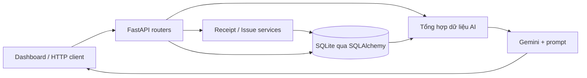

# Báo cáo kỹ thuật — Hệ thống quản lý kho tích hợp AI

> Báo cáo này ghi lại bản đóng gói ban đầu. Phần đăng nhập/RBAC và dashboard đã được hiện thực sau đó; dùng [phụ lục cập nhật](06_auth_dashboard.md) cho trạng thái mới, ảnh chạy và 8 test bổ sung. Các nhận định “chưa có đăng nhập” bên dưới thuộc phiên bản trước.

Thông tin sinh viên, lớp, giảng viên và đơn vị: bổ sung theo mẫu của trường.

## 1. Bài toán và phạm vi

Hệ thống hỗ trợ quản lý thông tin hàng hóa, theo dõi tồn kho và ghi nhận nhập/xuất. Phần AI diễn giải dữ liệu tổng hợp, gợi ý nhập hàng và chỉ ra dấu hiệu cần kiểm tra. AI không có công cụ ghi vào database; quyết định nghiệp vụ do người dùng thực hiện.

Phạm vi hiện thực gồm API FastAPI và dashboard có sẵn. RBAC trong tài liệu yêu cầu là định hướng, chưa được triển khai thành cơ chế đăng nhập/phân quyền thực tế.

## 2. Kiến trúc

Router nhận và kiểm tra payload bằng Pydantic, service xử lý transaction, model ánh xạ bảng bằng SQLAlchemy. Cấu hình database qua DATABASE_URL; khóa AI và model lấy từ môi trường. Docker đóng gói runtime và dùng volume cho SQLite.

## 3. Thiết kế dữ liệu

Category–Product là quan hệ một-nhiều; Product–Inventory là một-một. Receipt thuộc Supplier và có nhiều ReceiptItem; Issue có nhiều IssueItem. StockMovement ghi loại nhập/xuất, số lượng và số dư sau giao dịch. User được tham chiếu ở chứng từ. Bảng AIReport đã khai báo nhưng các endpoint AI hiện trả kết quả trực tiếp, chưa lưu báo cáo vào bảng.

ReceiptItem có unit_price; dữ liệu tổng hợp gửi AI không chứa trường này. Cần phân biệt thiết kế model với ràng buộc thực sự đang được SQLite thi hành.

## 4. Quy trình nghiệp vụ

Nhập kho: kiểm tra danh sách và số lượng, tạo phiếu confirmed, tạo dòng hàng, tăng tồn và ghi biến động trong cùng transaction. Có lỗi thì rollback.

Xuất kho: kiểm tra sản phẩm và số tồn, tạo phiếu confirmed, giảm tồn và ghi biến động. Service có xử lý thiếu tồn, nhưng còn hạn chế ở dòng hàng trùng sản phẩm và ghi đồng thời trên SQLite. Không khẳng định hệ thống đã bảo đảm mọi tình huống chống tồn âm.

## 5. Tích hợp AI

Backend tổng hợp mã/tên sản phẩm, đơn vị, tồn hiện tại, ngưỡng tối thiểu, lượng xuất 30 ngày, cờ cảnh báo và lượng thiếu. Điều kiện cảnh báo hiện là tồn nhỏ hơn hoặc bằng ngưỡng. Prompt yêu cầu trả lời tiếng Việt, không tự tạo số liệu và không thay đổi kho.

Ba chức năng là báo cáo kho, gợi ý nhập và tóm tắt bất thường. Đây là phân tích bằng mô hình ngôn ngữ trên số liệu tổng hợp, chưa phải mô hình dự báo nhu cầu đã huấn luyện/đánh giá. Không có số đo độ chính xác dự báo hoặc chất lượng AI được xác minh trong báo cáo này.

## 6. Kiểm thử và dữ liệu minh họa

Giai đoạn 3 có 10 test passed theo kết quả bàn giao của người thực hiện; không chạy lại trong đợt này. Không suy diễn kết quả đó thành kiểm thử tải, bảo mật hoặc nghiệm thu triển khai.

Bộ demo mới tạo 6 sản phẩm, 1 phiếu nhập, 1 phiếu xuất, 12 biến động, tổng tồn 94. PHONE01, QUAT01 và CAP001 ở dưới ngưỡng; CAP001 hết hàng. Smoke check trên database tạm đã xác minh số sản phẩm, biến động, tổng tồn và số cảnh báo; cần bổ sung ảnh trình diễn.

Giai đoạn 4 đã xác minh cấu hình Compose hợp lệ và smoke check trên Python 3.12.10 thành công: seed/audit không có phát hiện, seed lần hai từ chối, dashboard/schema trả HTTP 200 và dữ liệu AI đúng số cảnh báo. Không gọi Gemini thật. Chưa build/chạy container do Docker Engine chưa hoạt động và chưa xác minh cài dependency trong môi trường sạch. Cần bổ sung log nghiệm thu triển khai và ảnh chụp thực tế theo kịch bản demo.

## 7. Triển khai và vận hành

Chạy một container FastAPI, một worker, cổng 8000 chỉ bind localhost. Database nằm trong volume để giữ dữ liệu khi tạo lại container. Seed là thao tác chủ động, không chạy mỗi lần khởi động. Healthcheck kiểm tra HTTP/schema. Sao lưu dùng SQLite backup API; tài liệu README cung cấp lệnh.

Chưa có địa chỉ triển khai công khai. Chưa thực hiện kiểm thử phục hồi backup, tải đồng thời hoặc quan sát vận hành dài hạn. Các khoảng phiên bản dependency cần khóa lại sau khi build và nghiệm thu thành công.

## 8. Hạn chế và hướng phát triển

Ưu tiên xác thực/RBAC, bật và xử lý khóa ngoại, gộp dòng trùng sản phẩm khi xuất, ghi lịch sử điều chỉnh và bổ sung validation. Sau đó đánh giá database phục vụ ghi đồng thời, migration schema, log an toàn, lưu báo cáo AI và đánh giá chất lượng phản hồi bằng bộ dữ liệu có tiêu chí rõ ràng.

## 9. Tài liệu và minh chứng

Mã nguồn đối chiếu: `app/models.py`, `app/schemas.py`, `app/routers/`, `app/services/`, `prompts/`. Tài liệu đi kèm: README, rà soát dữ liệu và kịch bản demo. Báo cáo này mô tả trạng thái mã nguồn tại thời điểm bàn giao, không thay thế các bằng chứng runtime còn thiếu.
