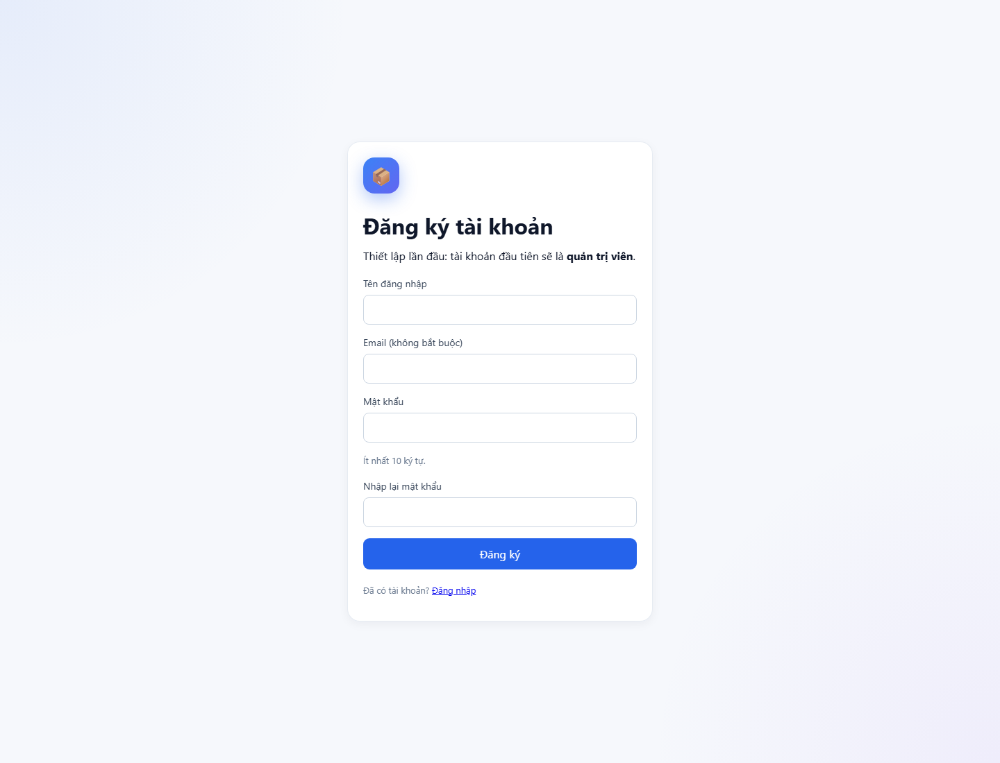
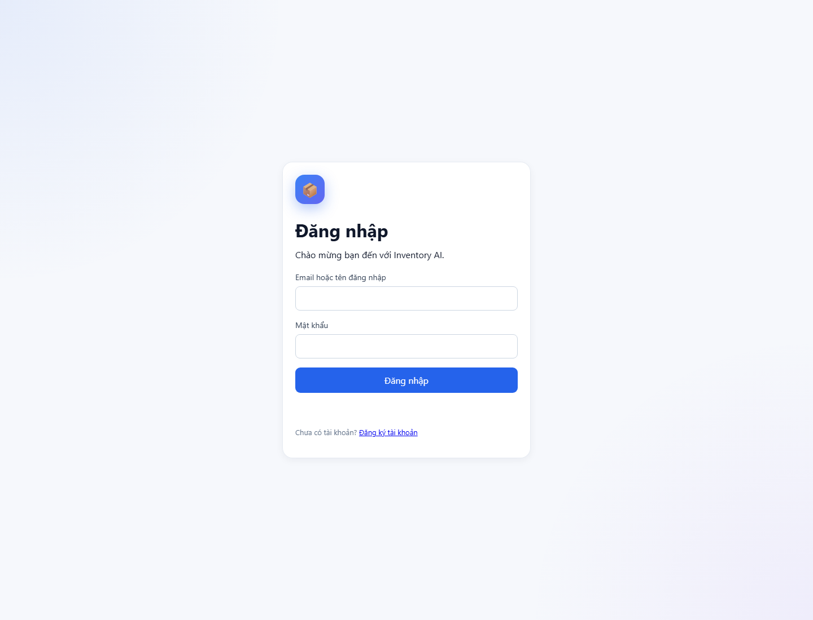
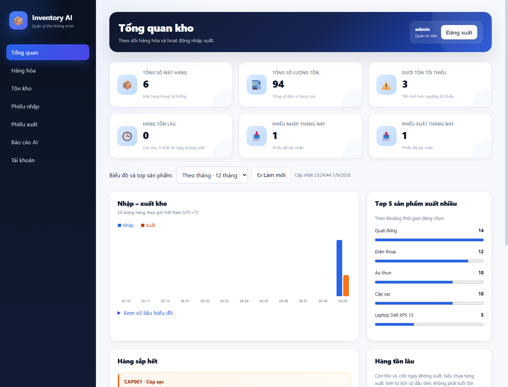
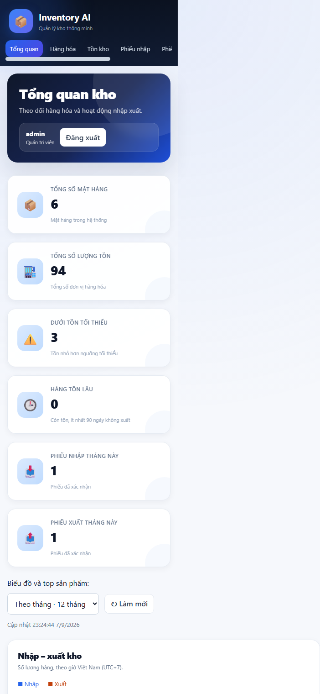

# Bổ sung đăng nhập, phân quyền và dashboard

> Cập nhật tiếp theo: [quản lý hàng hóa](07_product_management.md) đã có thêm/sửa/xóa/chi tiết/tìm kiếm/lọc nhóm. Bộ test mới tổng cộng 20 test thành công; mô tả giới hạn API sản phẩm chỉ xem/thêm ở cuối tài liệu này thuộc phiên bản trước.

## Cập nhật đăng ký trực tiếp trên giao diện

Trang `/login` đã có liên kết **Đăng ký tài khoản** đến `/register`. Nhập tên đăng nhập, email tùy chọn, mật khẩu ít nhất 10 ký tự và xác nhận. Tài khoản đầu tiên có định dạng mật khẩu mới được tạo với quyền quản trị viên và đăng nhập được ngay; tài khoản nội bộ/seed cũ không ngăn bước thiết lập này. Những tài khoản sau được lưu chưa kích hoạt, cần quản trị viên chọn quyền và trạng thái Hoạt động rồi Lưu tại mục Tài khoản. Không cần chạy script Terminal cho luồng này.

API `/auth/register` không cho truyền role/is_active, yêu cầu header cùng ứng dụng, giới hạn 10 đăng ký/IP/giờ. Transaction SQLite tuần tự hóa kiểm tra quản trị viên đầu tiên và tạo tài khoản; quản trị viên đã khóa không làm mở lại bước thiết lập. Email chưa được xác minh qua thư.

Kiểm chứng cập nhật: **11 test backend thành công**, bao gồm đăng ký đầu tiên, tài khoản chờ duyệt, duyệt rồi đăng nhập, trùng định danh, xác nhận mật khẩu, chặn tự gán quyền, giới hạn đăng ký và hai lượt đăng ký đồng thời chỉ tạo một quản trị viên. Chrome headless đã chạy qua bấm Đăng ký → tạo tài khoản → Đăng nhập → Dashboard. Không chạy lại suite AI Giai đoạn 3; database kiểm thử là bản tạm.

Các bước dùng `create_admin.py` dưới đây vẫn được giữ như phương án Terminal tùy chọn.

## Khởi tạo và sử dụng

1. Chạy `python create_admin.py` từ thư mục gốc với DATABASE_URL đang dùng. Nhập tên, email tùy chọn, mật khẩu và xác nhận. Không có mật khẩu mặc định; không chuyển mật khẩu qua tham số dòng lệnh.
2. Chạy `python -m uvicorn app.main:app --host 127.0.0.1 --port 8000`.
3. Mở `/login`, đăng nhập, xem dashboard.
4. Quản trị viên vào **Tài khoản** tạo người dùng với quyền thủ kho/kế toán. Có thể đổi quyền, khóa hoặc đặt mật khẩu mới. Các phiên của tài khoản được sửa bị hủy.
5. Nút **Đăng xuất** hủy phiên ở server và quay về form đăng nhập.

Docker: build lại image để có mã mới, rồi chạy `docker compose exec app python create_admin.py`. Không chạy seed nếu database đã có dữ liệu. Script chỉ tạo quản trị viên khởi đầu khi chưa có admin hoạt động với định dạng hash mới; dữ liệu tài khoản cũ được giữ nguyên.

## Quyền và bảo vệ backend

Quản trị viên thao tác mọi chức năng hiện có, bao gồm tài khoản. Thủ kho quản lý hàng hóa, tồn và phiếu nhập/xuất. Kế toán xem phiếu, thống kê và báo cáo AI, không được ghi dữ liệu kho. Các vai trò được đọc dữ liệu sản phẩm/tồn để đối chiếu. API thiếu phiên trả 401; sai quyền hoặc thiếu CSRF trả 403.

Cookie chỉ chứa token ngẫu nhiên, database lưu SHA256 của token. Mật khẩu được băm với PBKDF2-SHA256, salt ngẫu nhiên và 600.000 vòng. Phiên có hạn 8 giờ. Đăng xuất, khóa hoặc cập nhật tài khoản làm mất hiệu lực phiên. Cookie HttpOnly và SameSite=Strict; cấu hình Secure khi dùng HTTPS. Frontend gắn CSRF cho yêu cầu ghi. Người lập phiếu luôn lấy từ phiên, bỏ qua `created_by` trong payload cũ.

Thêm bảng `user_emails`, `auth_sessions`, `login_throttles` qua create_all, không ALTER hoặc xóa bảng users hiện có. Tên đăng nhập mới dùng chữ Latin, số, dấu chấm/gạch dưới/gạch nối; email được chuẩn hóa chữ thường và kiểm tra trùng. API không trả password_hash. Tên hàng và phản hồi AI được dựng bằng textContent để tránh thực thi HTML từ dữ liệu.

## Quy ước thống kê

- Tổng mặt hàng đếm Product; tổng tồn cộng số lượng, sản phẩm chưa có Inventory tính 0.
- Dưới tối thiểu: tồn `< min_stock_level`. AI Giai đoạn 3 vẫn cảnh báo cả lúc bằng ngưỡng (`<=`), không đổi logic AI.
- Tồn lâu: còn tồn và ≥90 ngày từ lần xuất cuối; nếu chưa xuất thì tính từ lịch sử đầu tiên. Không lịch sử thì đánh dấu thiếu cơ sở, không đưa vào số tồn lâu. Không phải tuổi hàng theo lô và không chứng minh hàng còn lại chính là hàng nhập từ 90 ngày trước.
- Phiếu nhập/xuất tháng này chỉ tính confirmed, biên tháng theo UTC+7.
- Biểu đồ lấy StockMovement loại import/export, có các kỳ số 0; tháng hiện tại theo ngày hoặc 12 tháng gần nhất. Top 5 xuất nhiều cùng kỳ.
- Nhận xét AI chỉ gọi khi người có quyền bấm nút, không tự gọi mỗi lần mở dashboard.

## Kiểm chứng

8 test mới thành công: anonymous/đăng nhập/đăng xuất; ma trận quyền 3 vai trò và người lập phiếu; CSRF, hết hạn và tài khoản khóa; đổi quyền/mật khẩu hủy phiên và giới hạn đăng nhập sai; xuất trùng dòng vượt tồn rollback; dashboard với biên tháng UTC+7, tồn lâu, chạm ngưỡng và dữ liệu rỗng.

Chrome headless thành công: đăng nhập/đăng xuất 3 vai trò qua form, menu tương ứng, dashboard 6 ô, đổi kỳ 12 tháng, trang phiếu và bố cục mobile. Không có exception JavaScript trong các luồng đó. Database và hồ sơ Chrome đều tạm, không sửa inventory.db gốc. Không gọi Gemini thật, không chạy lại 10 test Giai đoạn 3.

## Giới hạn còn lại

Chưa kiểm thử tải/ghi đồng thời, SSO, MFA, quên mật khẩu qua email hoặc phiên bản production qua HTTPS. SQLite foreign_keys toàn hệ thống và lịch sử PUT tồn trực tiếp vẫn cần hoàn thiện. API sản phẩm hiện có xem/thêm; không triển khai xóa hàng có lịch sử trong đợt này. Chưa build/chạy Docker Engine trong đợt bổ sung; Compose kiểm tra cấu hình hợp lệ.
