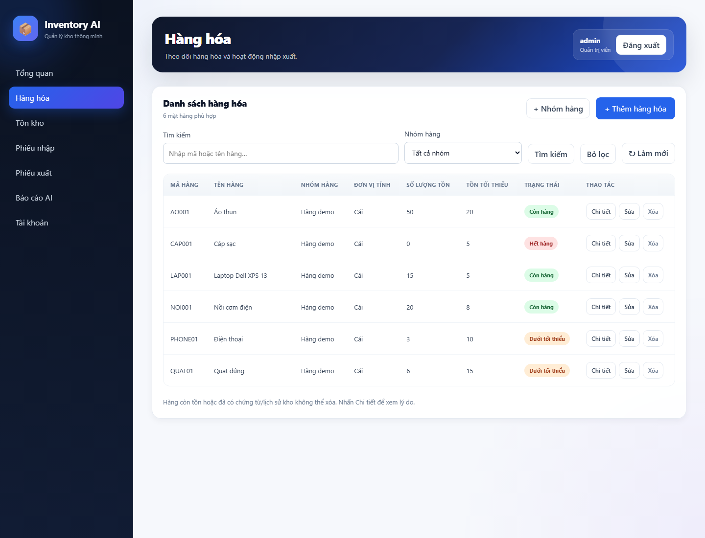

# Quản lý hàng hóa

Đăng nhập quản trị viên hoặc thủ kho, chọn **Hàng hóa**, hoặc mở `/workspace/products`.

## Chức năng

- Bảng gồm mã, tên, nhóm, đơn vị tính, số lượng tồn, tồn tối thiểu, trạng thái và các nút Chi tiết/Sửa/Xóa.
- **Thêm hàng hóa**: nhập thông tin, chọn nhóm hoặc để Chưa phân nhóm. Hàng mới có tồn bằng 0; tăng tồn bằng nghiệp vụ nhập kho.
- **Sửa**: cập nhật mã, tên, nhóm, đơn vị và mức tối thiểu. Backend giữ nguyên số lượng tồn.
- **Chi tiết**: hiển thị đầy đủ thông tin, thời điểm cập nhật tồn theo giờ Việt Nam và lý do không thể xóa nếu có.
- **Xóa**: hộp xác nhận hiển thị mã và tên trước khi thực hiện. Chỉ xóa hàng tồn bằng 0 và chưa có ReceiptItem, IssueItem hoặc StockMovement; áp dụng cả chứng từ nháp/hủy. Bản ghi Inventory đi kèm được xóa cùng transaction.
- **Tìm kiếm** theo mã/tên, không phân biệt chữ hoa/thường tiếng Việt; vẫn phân biệt dấu. Có thể kết hợp với lọc nhóm hoặc Chưa phân nhóm. Nút Bỏ lọc khôi phục danh sách.
- **Nhóm hàng**: thêm nhóm trực tiếp trên trang. Không cho tên rỗng hoặc trùng không phân biệt hoa/thường.

Trạng thái: tồn ≤0 là Hết hàng; tồn dương nhỏ hơn mức tối thiểu là Dưới tối thiểu; còn lại là Còn hàng. Số tồn âm của dữ liệu cũ vẫn hiển thị nguyên giá trị để nhận biết, không được phép xóa qua quy tắc tồn bằng 0.

## API và quyền

| API | Mục đích | Quyền |
|---|---|---|
| GET /products/?q=...&category_id=... | Danh sách, tìm kiếm, lọc; category_id=0 là chưa phân nhóm | Đã đăng nhập |
| GET /products/{id} | Chi tiết, tồn, trạng thái, khả năng xóa | Đã đăng nhập |
| POST /products/ | Thêm và tạo tồn ban đầu bằng 0 | Quản trị viên, thủ kho |
| PUT /products/{id} | Sửa toàn bộ thông tin mô tả | Quản trị viên, thủ kho |
| DELETE /products/{id} | Xóa hàng chưa sử dụng | Quản trị viên, thủ kho |
| GET /categories/ | Danh sách nhóm | Đã đăng nhập |
| POST /categories/ | Thêm nhóm | Quản trị viên, thủ kho |

Các API ghi kiểm tra phiên, quyền và CSRF. Kế toán chỉ đọc, không được sửa/xóa khi gọi API trực tiếp. Payload hàng hóa không nhận quantity_available; rỗng, vượt chiều dài, ngưỡng âm bị từ chối. Mã trùng trả 409, nhóm hoặc sản phẩm không tồn tại trả 404. Backend kiểm tra lại tồn/lịch sử khi xóa, không tin vào trạng thái nút trên giao diện. Với SQLite, thao tác xóa lấy khóa ghi trước khi kiểm tra và xóa.

## Kiểm chứng

**20 test thành công**: 9 test hàng hóa mới và 11 test đăng ký/đăng nhập/dashboard. Kiểm tra vòng đời thêm–sửa–chi tiết–xóa, giữ nguyên tồn khi sửa, lọc/tìm kiếm tiếng Việt, trạng thái, dữ liệu không hợp lệ, chặn xóa có tồn/lịch sử (nhập, xuất, biến động) và quyền ba vai trò.

Chrome headless đã chạy thao tác tạo nhóm, thêm hàng, lọc và tìm kiếm, xem chi tiết, sửa, hủy xác nhận xóa, xóa thành công, chặn xóa hàng demo có lịch sử và kiểm tra bố cục mobile. Chuỗi HTML trong tên hàng được hiển thị như văn bản, không tạo phần tử HTML. Không phát hiện exception JavaScript trong các luồng kiểm tra. Toàn bộ dùng database/profile tạm, không sửa inventory.db gốc; không chạy lại suite AI Giai đoạn 3.

## Giới hạn

Danh sách hiện phù hợp dữ liệu demo: tìm kiếm Unicode thực hiện trên danh sách đã lấy theo nhóm, chưa phân trang phía server hoặc tối ưu cho hàng trăm nghìn mặt hàng. Không triển khai xóa mềm/lưu trữ hàng đã có lịch sử; các hàng này vẫn giữ trong hệ thống. Chưa kiểm chứng toàn bộ ghi đồng thời ngoài luồng xóa SQLite.
